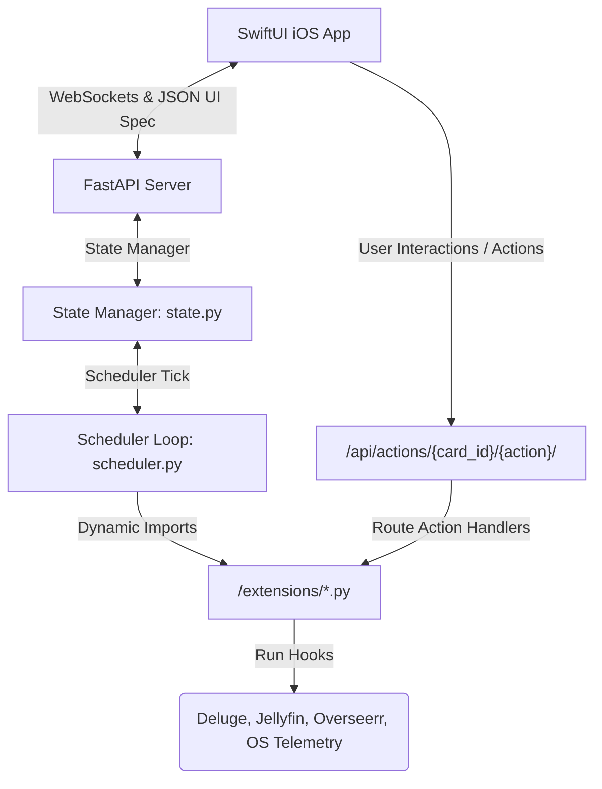

# Dashyy Backend & Layout Engine

Dashyy is a **Server-Driven UI (SDUI) Dashboard system** designed to display homelab telemetry and orchestrate actions in real time. The project consists of a Python/FastAPI backend that monitors services and broadcasts changes over WebSockets, and a native SwiftUI iOS client that dynamically renders the dashboard according to the JSON schemas provided by the server.

Because the UI is completely server-driven, you can restructure your layout, customize themes, add cards, and build complex nested widget systems simply by editing JSON configurations—**without writing a single line of Swift code or rebuilds.**

---

## 1. Project Architecture

The backend is built around a pluggable, modular, and service-agnostic layout runner:



### Key Technical Specs:
* **Pluggable Python Extensions**: All service-specific code (e.g. API authentication, scraping, and commands) resides in individual Python scripts inside the `extensions/` directory. The FastAPI engine is completely service-agnostic.
* **Flexible Function Signatures**: Telemetry collection functions support customizable arguments using reflection. They accept `current_state` (dictionary), and optionally `card_config` and `card_id`, returning a structured dictionary.
* **Granular Polling Intervals**: Each card specifies its own update rate (e.g., `pollInterval: 2.0` for CPU and `60.0` for library statistics). The scheduler checks timestamps every second to run only what is needed.
* **10-Strike Error Resiliency**: Transient network glitches or micro-outages won't trigger flashing red warning screens. The server caches the last-known successful output and only propagates an error state to the client if the extension throws exceptions 10 times consecutively.
* **Pluggable Interactive Actions**: Interactive buttons bind to action endpoints. Tapping a button in the client calls `/api/actions/{card_id}/{action}?id=X`, which dynamically resolves the extension and invokes its `handle_action` hook.
* **Docker Boot Isolation**: To prevent host volume mounts from wiping the standard extensions, default modules are kept in `default_extensions/` and automatically synchronized to `extensions/` on startup.

---

## 2. Directory Structure

```bash
├── config/
│   ├── dashboard.json          # Main dashboard container, columns, and theme details
│   └── cards/
│       ├── cpu_temp.json       # CPU temperature telemetry card layout
│       ├── deluge_torrents.json# Torrent client active queue layout
│       └── ...                 # Other layout card JSON configurations
├── default_extensions/         # Read-only default integration backups
├── extensions/                 # Pluggable active Python script modules (git-ignored)
├── src/
│   ├── main.py                 # FastAPI server and WebSocket connections dispatcher
│   ├── scheduler.py            # Async timing thread, reflection loader, and failure tracker
│   ├── state.py                # In-memory metrics caches and file-watcher sync tools
│   └── routes/
│       └── actions.py          # Generic actions router mapping client requests to extensions
└── README.md                   # This overview file
```

---

## 3. Dynamic Server-Driven Theme Engine

The overall layout, accent colors, and background backdrops are controlled by the `theme` object inside `config/dashboard.json`:

```json
  "theme": {
    "backgroundColors": ["#0A0E17", "#121829", "#1A102F"],
    "accentColor": "#6366F1"
  }
```

* **`backgroundColors`**: An array of hex strings mapped to a SwiftUI `LinearGradient`. Updates animate smoothly with a spring transition.
* **`accentColor`**: A hex string applied to foreground labels, loading progress indicator wheels, and system navigation links.

---

## 4. Layout Configurations Structure

The layout is divided into two parts:

### Dashboard Config (`dashboard.json`)
Declares the columns budget, sections, and the display order of cards:
```json
{
  "title": "My Homelab Dashboard",
  "refreshInterval": 5,
  "theme": { ... },
  "sections": [
    {
      "id": "system",
      "title": "System Monitor",
      "columns": 2,
      "cards": ["cpu_temp", "ram_usage"]
    }
  ]
}
```

### Card Configs (`config/cards/{card_id}.json`)
Each card is stored in its own JSON file. The `id` matches the filename.
```json
{
  "id": "cpu_temp",
  "title": "CPU Temperature",
  "size": "small",
  "extension": "system_metrics.get_cpu_usage",
  "pollInterval": 5.0,
  "apiConfig": {
    "url": "http://127.0.0.1:8000"
  },
  "widgets": [ ... ]
}
```

* **`size`**: Can be `small`, `medium`, or `large`. The iOS grid layout manager allocates grid columns based on this size and the section's column budget.
* **`extension`**: The target execution function (`module_name.function_name`) within the Python extensions folder.
* **`apiConfig`**: Freeform key-value dictionary. Use this to supply connection strings, credentials, or keys. It is passed into your extension function, separating code from configuration.

---

## 5. Mix & Match Card Configs (Widget Catalog)

Widgets are nested elements evaluated top-down to render the SwiftUI UI. Below is the documentation for all available widgets, properties, and values.

### Dot-Notation Path Resolvers (`valuePath`)
Wherever a widget exposes a `valuePath` field, it evaluates a dot-notation keypath within the card's active telemetry dictionary.
* **Nested Values**: `activeStreams.0.title` yields the title of the first item in the streams array.
* **Array Indexing**: Numeric keys (e.g. `0`, `1`) select index positions from lists.
* **Syntax Format**: You can option-prefix with `$.` (e.g. `$.torrents` and `torrents` are equivalent).

---

### UI Components Reference

| Widget Type | Purpose | Configuration Fields |
| :--- | :--- | :--- |
| **`row`** | Arranges children horizontally (`HStack`) | `children` (Array of Widgets) |
| **`column`** | Arranges children vertically (`VStack`) | `children` (Array of Widgets) |
| **`text`** | Renders static or dynamic text fields | `text` (String), `valuePath` (Keypath), `size` (Number), `isBold` (Bool), `color` (Hex/Name), `lineLimit` (Int), `unit` (Suffix String), `thresholds` (Array) |
| **`badge`** | Renders a colored text pill label | `valuePath` (Keypath), `icon` (SF Symbol), `color` (Hex/Name), `mappings` (Dict mapping status to color) |
| **`progress`** | Renders a dynamic capsule progress bar | `valuePath` (Keypath, values: `0.0` - `1.0`), `color` (Hex/Name) |
| **`button`** | Renders an interactive action button | `icon` (SF Symbol), `text` (String), `color` (Hex/Name), `actionPath` (String path template) |
| **`chart`** | Plots real-time historic timelines | `chartType` (`"area"` or line), `valuePath` (Keypath to array of points), `yKeys` (Array of keys), `seriesLabels` (Array of legend labels), `colors` (Array of hexes), `unit` (Axis suffix) |
| **`image`** | Renders local-cached remote thumbnails | `valuePath` (Keypath resolving to URL string), `icon` (Fallback SF Symbol), `size` (Constraints width & height) |
| **`list`** | Iteratively renders arrays of records | `arrayPath` (Keypath to array), `direction` (`"vertical"` or `"horizontal"`), `itemLayout` (Array of template widgets) |
| **`divider`** | Visual separating rule line | *None* |
| **`spacer`** | Adaptive empty space pushing widgets apart | *None* |

> [!TIP]
> **System Colors**: Available standard names are: `red`, `orange`, `green`, `blue`, `yellow`, `purple`, `mint`, `cyan`, `indigo`, and `secondary`. For pixel-perfect styles, use hex codes like `"#6366F1"`.

---

### Step-by-Step Layout Examples

#### Example 1: Single Numeric Metric Card
Suitable for representing simple numbers like temperature, bandwidth, or CPU utilization. Uses dynamic color changes based on values.

```json
{
  "id": "cpu_temp",
  "title": "CPU Temperature",
  "size": "small",
  "extension": "system_metrics.get_cpu_usage",
  "widgets": [
    {
      "type": "row",
      "children": [
        {
          "type": "text",
          "valuePath": "value",
          "size": 34,
          "isBold": true,
          "unit": "°C",
          "thresholds": [
            {"value": 55.0, "color": "orange"},
            {"value": 75.0, "color": "red"}
          ]
        }
      ]
    },
    {
      "type": "row",
      "children": [
        { "type": "badge", "valuePath": "trend", "mappings": {"up": "red", "down": "green", "stable": "secondary"}, "icon": "arrow.up.right" },
        { "type": "text", "valuePath": "trend", "size": 12, "color": "secondary" }
      ]
    }
  ]
}
```

#### Example 2: Interactive List Card (e.g. Torrent Client)
Suitable for lists with interactive commands. We nest labels, progress bars, and execution buttons.

```json
{
  "id": "deluge_torrents",
  "title": "Deluge Active Transfers",
  "size": "large",
  "extension": "deluge.get_status",
  "widgets": [
    {
      "type": "row",
      "children": [
        { "type": "text", "text": "DL Speed:", "size": 11 },
        { "type": "text", "valuePath": "downloadSpeedText", "isBold": true, "size": 11, "color": "green" },
        { "type": "spacer" },
        { "type": "text", "text": "UL Speed:", "size": 11 },
        { "type": "text", "valuePath": "uploadSpeedText", "isBold": true, "size": 11, "color": "blue" }
      ]
    },
    { "type": "divider" },
    {
      "type": "list",
      "arrayPath": "torrents",
      "direction": "vertical",
      "itemLayout": [
        {
          "type": "column",
          "children": [
            {
              "type": "row",
              "children": [
                { "type": "text", "valuePath": "name", "isBold": true, "size": 12, "lineLimit": 1 },
                { "type": "spacer" },
                { "type": "badge", "valuePath": "status", "mappings": {"Downloading": "green", "Seeding": "blue", "Paused": "orange"} }
              ]
            },
            {
              "type": "row",
              "children": [
                { "type": "progress", "valuePath": "progress", "color": "green" },
                { "type": "text", "valuePath": "progressPercentText", "size": 10, "color": "secondary" }
              ]
            },
            {
              "type": "row",
              "children": [
                { "type": "text", "valuePath": "speedText", "size": 9, "color": "secondary" },
                { "type": "spacer" },
                { 
                  "type": "button", 
                  "icon": "pause.fill", 
                  "actionPath": "deluge_torrents/toggle?id={id}" 
                },
                { 
                  "type": "button", 
                  "icon": "trash.fill", 
                  "color": "red", 
                  "actionPath": "deluge_torrents/delete?id={id}" 
                }
              ]
            }
          ]
        }
      ]
    }
  ]
}
```

#### Example 3: Visual Asset Grid (Recently Added Posters)
Suitable for media catalog updates. Uses `direction: "horizontal"` to display columns side-by-side.

```json
{
  "id": "jellyfin_recent",
  "title": "Recently Added Media",
  "size": "large",
  "extension": "jellyfin.get_playback",
  "widgets": [
    {
      "type": "list",
      "arrayPath": "recentlyAdded",
      "direction": "horizontal",
      "itemLayout": [
        {
          "type": "column",
          "children": [
            {
              "type": "image",
              "valuePath": "imageUrl",
              "size": 80,
              "icon": "film"
            },
            {
              "type": "text",
              "valuePath": "title",
              "size": 10,
              "isBold": true,
              "lineLimit": 1
            }
          ]
        }
      ]
    }
  ]
}
```

#### Example 4: Historical Timelines Chart Card
Perfect for system vitals or speed charts. Fits in `medium` or `large` cards.

```json
{
  "id": "network_chart",
  "title": "Network Traffic (24h)",
  "size": "medium",
  "extension": "system_metrics.get_network_traffic",
  "widgets": [
    {
      "type": "chart",
      "chartType": "area",
      "valuePath": "history",
      "yKeys": ["download", "upload"],
      "seriesLabels": ["Download (Mb/s)", "Upload (Mb/s)"],
      "colors": ["#3B82F6", "#10B981"],
      "unit": " Mbps"
    }
  ]
}
```

---

## 6. Development & Operations Guide

### 1. Set Up Environment & Run Locally
```bash
# Create a virtual environment
python3 -m venv venv
source venv/bin/activate

# Install requirements
pip install -r requirements.txt

# Start the uvicorn development server
uvicorn src.main:app --reload --host 0.0.0.0 --port 8000
```

### 2. Verify Your Configuration Changes
Once the server is running, query the generic layout config endpoint:
```bash
curl -s http://127.0.0.1:8000/api/dashboard | json_pp
```
This is the payload parsed by the mobile client. Any layout errors or invalid structures will immediately show here.

### 3. Deploying in Production

You can deploy the application using the pre-built, multi-architecture Docker image from Docker Hub: `adityasm1238/dashyy:latest`.

Run the container using:
```bash
docker run -d \
  -p 8000:8000 \
  -v $(pwd)/config:/app/config \
  -v $(pwd)/extensions:/app/extensions \
  --name dashyy \
  adityasm1238/dashyy:latest
```

Alternatively, to build the image locally or deploy with the included `deployment.yaml`:
```bash
# Build locally
docker build -t adityasm1238/dashyy:latest .
```

Make sure to mount `/app/config/` and `/app/extensions/` to persistent volumes so that your dashboard settings and custom python extensions are retained. The container's entrypoint script automatically pre-loads default extensions into the mounted `/app/extensions/` folder if it is initially empty.
